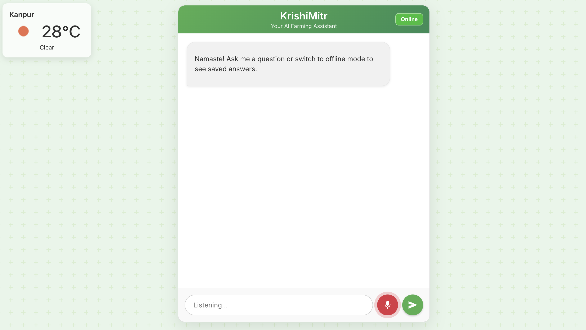

# 🌾 KrishiMitr - Multilingual AI Farming Assistant

---

## 🚀 Live Application

You can access the live, deployed version of KrishiMitr here:

-   **Live Application (Frontend):** **[https://krishimitr-xngl.onrender.com](https://krishimitr-xngl.onrender.com)**
-   **Backend API Endpoint:** **[https://krishimitr-backend.onrender.com](https://krishimitr-backend.onrender.com)**

---

[](https://golang.org/)
[](https://reactjs.org/)
[](https://aistudio.google.com/)

**KrishiMitr** is an intelligent, multilingual chatbot designed to be a reliable assistant for Indian farmers. It provides real-time information on crop prices, weather forecasts, and answers a wide range of agricultural questions. The application is built with a resilient architecture that includes an offline mode, making it practical for use in areas with poor connectivity.

 

---

## ✨ Core Features

*   **Intelligent Q&A:** Ask complex agricultural questions in English, Hindi, or Hinglish and get accurate answers from Google's Gemini AI.
*   **Live Crop Prices:** Fetches real-time market prices for various commodities from official government APIs (`data.gov.in`).
*   **Multilingual Support:** Interact with the chatbot via text or voice in Hindi, Hinglish, or English, and receive responses in the appropriate language and script.
*   **Live Weather Widget:** A persistent UI widget that displays the current weather for the user's location. Includes a smart fallback to display realistic data if the primary API fails.
*   **Voice-to-Text:** Use the built-in voice recognition to ask questions hands-free.
*   **Offline Mode:** Previously asked questions and their answers are cached locally. The app can be switched to offline mode to access this data without an internet connection.
*   **Modern UI:** A clean, responsive, and intuitive chat interface built with React.

---

## 🛠️ Technology Stack

This project is a full-stack application composed of a Go backend and a React frontend.

**Backend:**
*   **Language:** Go (Golang)
*   **Web Framework:** Net/HTTP (Go Standard Library)
*   **Database:** SQLite for offline caching
*   **AI Integration:** `google/generative-ai-go` for Google Gemini
*   **Dependencies:** `go-sqlite3`, `godotenv`

**Frontend:**
*   **Framework:** React
*   **Styling:** Plain CSS with Flexbox
*   **Core Libraries:** `react-markdown` for rendering formatted text
*   **APIs:** Web Speech API (for voice), Geolocation API (for location)

---

## 🚀 Getting Started

Follow these instructions to set up and run the project locally.

### Prerequisites

*   [Go](https://golang.org/dl/) (version 1.18 or newer)
*   [Node.js](https://nodejs.org/) (version 16 or newer) and npm
*   Git

### 🔑 API Keys

You will need to acquire the following API keys and place them in the correct environment files.

1.  **Google AI (Gemini):**
    *   Go to [Google AI Studio](https://aistudio.google.com/) and create an API key.
    *   Place it in `krishimitr-backend/.env`.

2.  **data.gov.in:**
    *   Register on [data.gov.in](https://data.gov.in/) to get your API key.
    *   Place it in `krishimitr-backend/.env`.

3.  **OpenWeatherMap:**
    *   Create an account on [OpenWeatherMap](https://openweathermap.org/) to get an API key.
    *   Place it in `krishimitr-frontend/.env`.

### ⚙️ Setup and Installation

1.  **Clone the repository:**
    ```bash
    git clone https://github.com/kanavsingh22/krishimitr.git
    cd krishimitr
    ```

2.  **Set up the Backend:**
    ```bash
    cd krishimitr-backend

    # Create the environment file
    cp .env.example .env 
    # Or manually create a .env file and add your keys:
    # GEMINI_API_KEY=YOUR_GEMINI_KEY_HERE
    # DATA_GOV_API_KEY=YOUR_DATA_GOV_KEY_HERE

    # Install dependencies
    go mod tidy

    # Run the backend server
    go run main.go
    ```
    The backend server will start on `http://localhost:8080`.

3.  **Set up the Frontend:**
    *(Open a new terminal window for this part)*
    ```bash
    cd krishimitr-frontend

    # Create the environment file
    cp .env.example .env
    # Or manually create a .env file and add your key:
    # REACT_APP_OPENWEATHER_API_KEY=YOUR_OPENWEATHER_KEY_HERE

    # Install dependencies
    npm install

    # Run the frontend development server
    npm start
    ```
    The frontend application will open in your browser at `https://localhost:3000`.

---

## 💡 How It Works

1.  **Frontend (React):** Captures user input (text or voice) and sends it to the Go backend. It also handles the weather widget and offline toggle.
2.  **Backend (Go):** Acts as an intelligent orchestrator.
    *   It first checks if the query is for a crop price. If so, it calls the `data.gov.in` API and formats the response.
    *   For all other queries, it forwards the message to the Google Gemini API with a specific system instruction to handle multiple languages.
    *   In **online mode**, all successful conversations are saved to the local `krishimitr.db` SQLite database which acts a kiosk server later.
    *   In **offline mode**, it searches the SQLite database for a relevant cached answer instead of calling external APIs.

---
